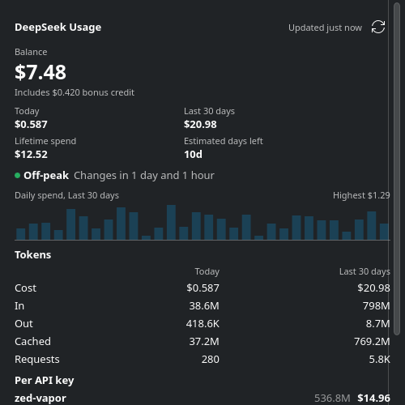
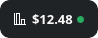

# DeepSeek Usage — a Plasma 6 widget

A small, dependency-free KDE Plasma 6 applet that shows your DeepSeek API
balance and usage in the panel, with a detailed popup.

- **Panel:** an icon plus the number you choose (balance, today's spend,
  today's tokens, period spend or lifetime spend).
- **Popup:** balance, today/period/lifetime spend, an estimated "days left",
  in/out/cached tokens and request counts, a daily-spend sparkline and a
  per-API-key breakdown.
- **Secrets live in KWallet**, never in the widget's configuration file.
- **No runtime dependencies** beyond Plasma and Qt: network access is QML
  `XMLHttpRequest`, parsing is plain JavaScript, and KWallet is reached through
  `kwallet-query`.



As a panel chip (icon plus the chosen number):



## Install

```sh
./install.sh            # install or upgrade for the current user
./install.sh --pack     # write deepseek-usage.plasmoid for distribution
./install.sh --uninstall
```

Then add **DeepSeek Usage** to a panel or the desktop. Right-click the widget →
*Configure…* to add your credentials.

## Credentials

Two different credentials exist, and they are not interchangeable.

| | API key | Session token |
|---|---|---|
| Where to get it | <https://platform.deepseek.com/api_keys> | the value the platform site keeps after you log in |
| Scope | your account's API access | **full account access**, including creating and deleting API keys |
| Gives you | balance only | balance, lifetime spend and usage history |
| Stored as | `deepseek-api-key` in KWallet | `deepseek-session-token` in KWallet |

Both are written to KWallet (wallet `kdewallet`, folder `Plasma`) and read back
with `kwallet-query`. The API key alone is enough for the balance; adding the
session token enables the usage sections. If the session token stops working
the widget falls back to the balance and tells you why.

> [!WARNING]
> The session token is as powerful as your password. Treat it like one, and
> remove it from KWallet if you stop using rich mode.

## Data sources

The widget is a hybrid because DeepSeek exposes two unrelated APIs.

**Official API** (`api.deepseek.com`) — API-key authenticated, documented,
reliable, but it only reports the balance:

```
GET https://api.deepseek.com/user/balance
Authorization: Bearer <API_KEY>
```

**Platform API** (`platform.deepseek.com/api/v0`) — the backend behind the web
usage page. It is session authenticated and **undocumented**, so it can change
at any time:

```
GET /users/get_user_summary
GET /usage/by_api_key/amount?start=&end=&tz=
GET /usage/by_api_key/cost?start=&end=&tz=
authorization: Bearer <SESSION_TOKEN>
```

Two quirks worth knowing:

- The platform API answers **HTTP 200 even for auth failures**, putting the
  real status in the JSON body (`{"code":40003,...}`). The widget therefore
  classifies results from the payload, never from the HTTP status.
- Cost and token payloads nest their series differently (`data.biz_data.data[]
  .series[]` for cost, `data.biz_data.series[]` for tokens).

Because there is no documented "usage" endpoint, the spend figures and the
"estimated days left" value are **derived** from this API and are labelled as
such in the popup.

## Configuration

| Setting | Default | Meaning |
|---|---|---|
| Refresh interval | 300 s | how often to poll (minimum 30 s) |
| Panel shows | Balance | which number appears in the panel |
| Cost period | 30 days | window for the period totals and the sparkline |
| Hide all amounts | off | replace every amount on screen with bullets |

The per-key breakdown lists API key **names** only. The masked key id that the
platform reports is deliberately never rendered anywhere.

## Peak and off-peak pricing

DeepSeek charges half price outside its peak hours, so the widget shows which
rate is in effect: a small dot on the panel chip, and the state plus the time
left in it in the popup and tooltip.

- **green** — off-peak: you are paying the discounted rate
- **red** — peak: you are paying full price
- **neutral** — unknown: see below

The schedule is [documented](https://api-docs.deepseek.com/quick_start/pricing)
as *01:00–04:00 and 06:00–10:00 UTC, Monday to Friday, excluding Chinese public
holidays*; all other hours are off-peak, including weekends and holidays in full.

### Why it can say "Unknown"

The weekday and time-of-day part of that rule is exact and always applies. The
holiday exception is different: the State Council publishes the following year's
dates only in November or December and can revise them, so it is data that has to
be maintained by hand and cannot be derived.

The widget therefore will not guess. `CHINESE_HOLIDAYS` in
`contents/ui/js/peak.js` holds the published schedule, block by block, for the
years that have been announced:

```js
addRange("2026-10-01", "2026-10-07"); // National Day
```

When asked about a year the table does not cover, the state is reported as
**Unknown** rather than assuming those days are ordinary working days — assuming
that would report peak while DeepSeek was charging the off-peak rate. Estimated
dates must not be added either, for the same reason in the other direction: a
wrong entry would claim a discount that does not exist.

### Keeping it current

`node --test tests/peak.test.mjs` includes a deliberate maintenance alarm: it
**fails once the table no longer covers the current year**, and also fails if any
covered year looks half-filled. Add the newly published year with `addRange()`
and the tests go green again. Announced in November/December for the following
year, so that is the once-a-year chore.

## Development

The parsing, formatting and KWallet command logic live in plain JavaScript
modules under `contents/ui/js/` so they can be tested without a Plasma session:

```sh
node --test tests/api.test.mjs tests/format.test.mjs tests/wallet.test.mjs
```

`tests/mock-platform-server.mjs` serves the recorded payload shapes of the
platform API, which is the only way to exercise rich mode without live
credentials. Point `PLATFORM_BASE` in `contents/ui/js/api.js` at
`http://127.0.0.1:8731/api/v0` while you test, then put it back.

Static checks for the QML side:

```sh
qmllint contents/ui/*.qml contents/config/config.qml
```

Rendering the applet once per locale, to spot mojibake or text that overflows
the popup (Hindi and Russian run much longer than English):

```sh
tests/capture-locales.sh /tmp/shots zh_CN ru_RU hi_IN
```

## Translations

The widget ships 17 catalogues: Simplified Chinese, English (India), Hindi,
Indonesian, French, Russian (Russia and Belarus), Spanish (Spain and four
Latin-American variants), plus bare-language aliases that widen Qt's locale
fallback. Translations live in `translate/`; see
[`translate/README.md`](translate/README.md) for the workflow and the table
format.

```sh
./translate/merge.sh          # re-extract template.pot after changing i18n() calls
./translate/build.sh          # regenerate .po and compile .mo
./translate/build.sh --check  # CI: fail if any catalogue is out of date
```

> [!WARNING]
> **Every catalogue is machine-generated and has never been reviewed by a native
> speaker.** Each `.po` records this in its header, and its `Language-Team` field
> is still gettext's "no catalogue has been claimed" placeholder. Treat them as a
> starting point, not as finished translation.
>
> **Priority for review: Hindi, Russian and Simplified Chinese** — the languages
> this widget is most likely to be used in, and the ones where an unreviewed
> translation is least acceptable. Everything else is a bonus.

The chosen route for fixing that is **KDE's own translation teams** (decision
D13): it is the only one that yields *reviewed* translations by people who
actually speak the language. `Messages.sh` in the repository root is already the
entry point KDE's tooling expects, and `translate/README.md` lists the concrete
steps — the main precondition being that the widget has to live in a KDE
repository before the teams can pick it up. Crowdin/Transifex configs are kept
only as a fallback, explicitly marked as never run.

## License

GPL-2.0-or-later. See `LICENSE`.
